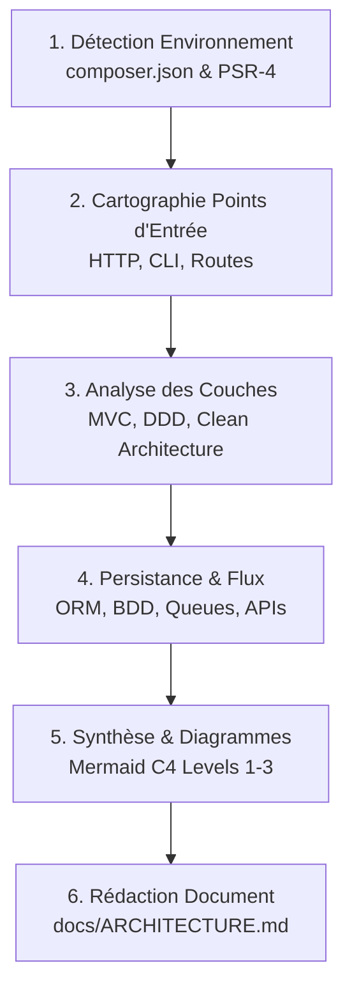

# Générateur de Documentation d'Architecture PHP (Modèle C4)

Ce skill guide l'agent dans l'analyse statique d'un projet PHP et la génération d'un document d'architecture clair, complet et standardisé, respectant les 4 niveaux du modèle C4 enrichis des spécificités PHP.

---

## Heuristiques de Détection Multi-Frameworks

Avant toute analyse détaillée, identifier le type de projet à l'aide de cette matrice de détection :

| Framework / Type | Signatures caractéristiques (`composer.json`) | Fichiers / Dossiers marqueurs | Points d'entrée typiques |
| :--- | :--- | :--- | :--- |
| **Symfony** | `symfony/framework-bundle`, `symfony/flex` | `config/bundles.php`, `config/packages/`, `src/Entity/` | `public/index.php`, `bin/console` |
| **Laravel** | `laravel/framework` | `app/Providers/`, `bootstrap/app.php`, `artisan` | `public/index.php`, `artisan`, `routes/web.php` |
| **Slim / Micro** | `slim/slim`, `mezzio/mezzio` | `src/App/`, `config/container.php` | `public/index.php` |
| **WordPress** | `roots/bedrock` ou structure WP | `wp-config.php`, `wp-content/`, plugins/thèmes | `index.php`, `wp-admin/` |
| **CakePHP / Laminas** | `cakephp/cakephp`, `laminas/laminas-mvc` | `src/Model/`, `src/Controller/`, `config/app.php` | `webroot/index.php`, `bin/cake` |
| **Custom / Legacy** | Absence de framework MVC standard | Fichiers PHP racine, `includes/`, `classes/`, `lib/` | `index.php`, scripts PHP directs |

---

## Déroulement de l'Analyse (Workflow en 6 Étapes)

### Étape 1 — Détection de l'Environnement & Dépendances

1. **Lire `composer.json`** :
   - Version PHP requise (ex. `^8.1`, `^8.2`, `^8.3`).
   - Framework principal et version exacte.
   - Outils de persistance / ORM : `doctrine/orm`, `illuminate/database`, `cycle/orm`, `doctrine/dbal`, PDO.
   - Traitements asynchrones & Queues : `symfony/messenger`, `enqueue/enqueue`, `vlucas/phpdotenv`.
   - Clients HTTP & APIs : `guzzlehttp/guzzle`, `symfony/http-client`.
   - Authentification / Sécurité : `symfony/security-bundle`, `laravel/sanctum`, `firebase/php-jwt`, `lexik/jwt-authentication-bundle`.
   - Packages de tests & qualité : `phpunit/phpunit`, `pestphp/pest`, `phpstan/phpstan`, `vimeo/psalm`.
2. **Analyser l'Autoloading PSR-4 / PSR-0** :
   - Extraire les correspondances namespace/dossier (ex. `"App\\": "src/"` ou `"App\\": "app/"`).

### Étape 2 — Cartographie des Points d'Entrée & Routage

1. **Points d'entrée HTTP** :
   - Repérer le document root (`public/index.php`, `web/app.php`, `index.php`).
   - Identifier le système de routage :
     - **Symfony** : `config/routes.yaml`, `config/routes/`, ou Attributs PHP 8 `#[Route(...)]` dans les contrôleurs.
     - **Laravel** : `routes/web.php`, `routes/api.php`, `routes/console.php`.
     - **Slim / Micro** : Définition des routes dans `src/routes.php` ou `public/index.php`.
     - **Custom/Legacy** : Routage par script PHP direct ou `$_GET['action']` / `switch`.
2. **Points d'entrée CLI & Tâches planifiées** :
   - Commandes CLI : `bin/console` (Symfony Console), `artisan` (Laravel Artisan), scripts sous `bin/` ou `scripts/`.
   - Planificateurs : Crontab, `schedule:run` (Laravel Scheduler), crons custom.

### Étape 3 — Analyse des Couches Logicielles & Classification d'Architecture

Classifier l'architecture du projet parmi les archétypes :
- **MVC Classique** : Séparation stricte Contrôleurs (`src/Controller/`), Modèles/Entités (`src/Entity/`), Vues (`templates/` ou Twig/Blade).
- **Architecture Hexagonale / Ports & Adapters / Clean Architecture** :
  - Domaine métier pur (`Domain/`, `Core/`, sans dépendances framework).
  - Couche Application (`Application/`, `UseCases/`, `Commands/`, `Queries/`).
  - Couche Infrastructure (`Infrastructure/`, `Adapters/`, `Persistence/`).
- **Monolithe Modulaire / Modules découplés** : Découpage par bounded contexts ou sous-domaines (ex. `src/Billing/`, `src/Users/`, `src/Inventory/`).
- **Architecture API First / Backend for Frontend (BFF)** : Contrôleurs d'API purs, DTOs, Serializers, API Platform (`api-platform/core`).
- **Scripting / Procédural Legacy** : Scripts PHP autonomes avec inclusions manuelles (`require`/`include`).

### Étape 4 — Persistance, Données & Intégrations Externes

1. **Couche de Données** :
   - Identifier les entités, modèles et schémas (`src/Entity/`, `app/Models/`).
   - Vérifier les outils de migration (`doctrine/doctrine-migrations-bundle`, `database/migrations`).
   - Repérer les configurations de bases de données (`config/packages/doctrine.yaml`, `.env`, `config/database.php`).
2. **Intégrations Externes & APIs Tiers** :
   - Repérer les services d'appel HTTP (clients Guzzle/Symfony HttpClient).
   - Repérer les services d'envoi de mail, passerelles de paiement, stockage d'objets (S3, Flysystem).

### Étape 5 — Synthèse C4 & Génération des Diagrammes Mermaid

Générer des diagrammes Mermaid **valides, compacts et lisibles** :
1. **Niveau 1 (Contexte)** : Flux `flowchart TD` présentant les utilisateurs/acteurs, le système PHP, et les APIs/tiers externes.
2. **Niveau 2 (Conteneurs)** : Vue `graph TD` reliant le serveur web, le runtime PHP (FPM/CLI), la BDD (MySQL/Postgres/etc.), le cache (Redis), et le broker de messages (Messenger/RabbitMQ).
3. **Niveau 3 (Composants)** : Schéma `flowchart LR` montrant le pipeline Contrôleur -> Middleware/Handler -> Service Métier -> Repository -> BDD.
4. **Flux de Séquence** : Diagramme `sequenceDiagram` illustrant une requête typique de bout en bout.

### Étape 6 — Rédaction du Document d'Architecture

1. Utiliser le template de référence disponible dans `templates/architecture-template.md`.
2. Créer ou mettre à jour le fichier `docs/ARCHITECTURE.md` (ou l'emplacement spécifié par l'utilisateur).
3. Remplir fidèlement chaque section avec les éléments factuels observés lors des étapes 1 à 4.

---

## Règles d'Or & Discipline

- **Inspection Statique Uniquement** : Ne jamais exécuter de code PHP, de scripts arbitraires ni de commandes modifiant la base de données ou le code source.
- **Règle de Non-Présomption (Zéro Hallucination)** :
  - Tout élément non observé directement dans le code source ou la configuration DOIT être explicitement annoté `(à vérifier)` (ex. version exacte du serveur web Nginx en production, configuration réseau cloud, etc.).
- **Syntaxe Mermaid Rigoureuse** :
  - Pas de balises HTML complexes ni de retours à la ligne ` ` non supportés.
  - Déclarer des identifiants de nœuds simples et lisibles.
- **Précision des Versions** : Toujours mentionner la version de PHP et des bundles/frameworks clés extraite de `composer.json` ou `composer.lock`.
- **Adaptation Dynamique** : Si le projet est un monolithe legacy sans Composer, adapter l'analyse en documentant la structure des répertoires et les mécanismes d'inclusion sans forcer des concepts de bundles inexistants.
