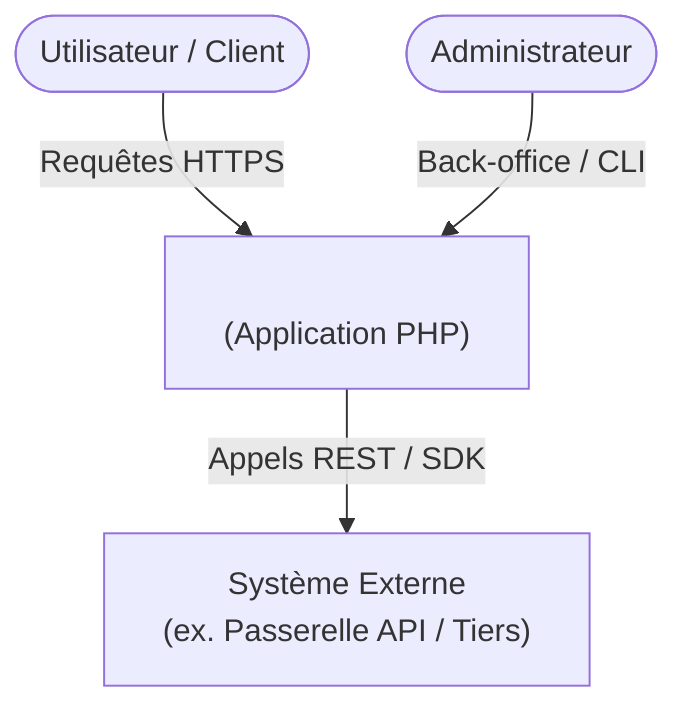
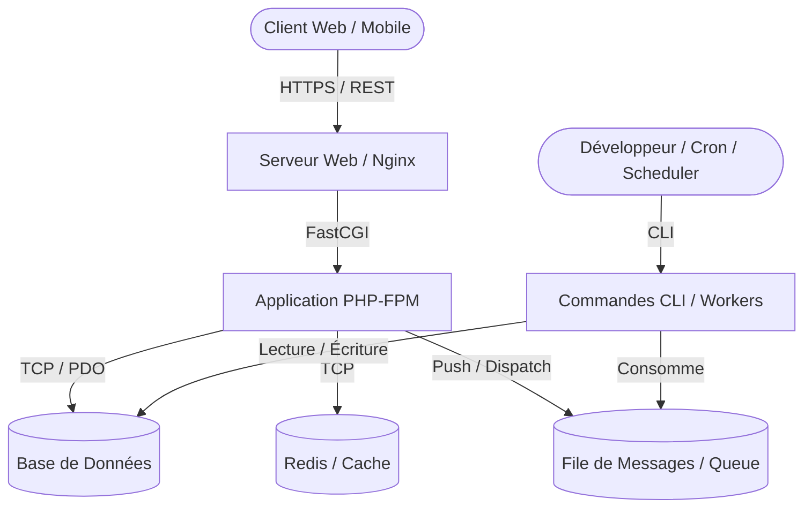
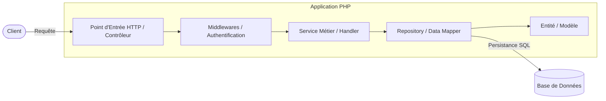
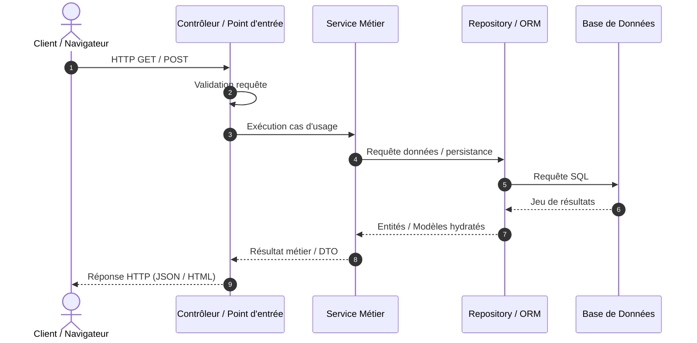

# Architecture Technique — <Nom du Projet>

> Document généré le : `<Date>`  
> Framework principal : `<Framework ou Standalone>`  
> Version PHP : `<PHP Version>`  

---

## 1. Fiche d'identité & Résumé Exécutif

| Caractéristique | Valeur observée |
| :--- | :--- |
| **Type de projet** | `<API REST / Monolithe Web / Microservice / CLI / Legacy>` |
| **Framework(s)** | `<ex. Symfony 6.4, Laravel 10, Slim 4, Custom>` |
| **Version PHP** | `<ex. ^8.2>` |
| **Gestionnaire de dépendances** | Composer (`composer.json`) |
| **Persistance / ORM** | `<ex. Doctrine ORM, Eloquent, PDO natif, Aucun>` |
| **Architecture dominante** | `<ex. MVC classique, DDD / Hexagonale, Modulaire, Scripting>` |
| **Points d'entrée principaux** | `<ex. HTTP (public/index.php), CLI (bin/console ou artisan)>` |

---

## 2. Niveau 1 : Contexte Système

Présentation des frontières applicatives, des utilisateurs cibles et des interactions avec les systèmes tiers.

### 2.1 Description des Acteurs & Systèmes
- **Utilisateurs / Acteurs** : `<ex. Utilisateur Web, Administrateur, Client API>`
- **Système analysé** : `<Nom du Projet>`
- **Systèmes externes & Dépendances** : `<ex. Passerelle de paiement Stripe, API Mailer, SSO OAuth2>`

### 2.2 Diagramme de Contexte (C4 - Level 1)



---

## 3. Niveau 2 : Conteneurs & Environnement d'Exécution

Description de la pile d'exécution, des processus d'arrière-plan, des bases de données et des mécanismes de stockage.

### 3.1 Cartographie des Conteneurs

| Conteneur / Service | Rôle technique | Technologie / Package |
| :--- | :--- | :--- |
| **Web Server / Gateway** | Réception HTTP & reverse proxy | Nginx / Apache / Traefik *(à vérifier)* |
| **Application PHP** | Exécution du code applicatif | PHP-FPM / CLI Runtime |
| **Base de Données** | Persistance relationnelle / documentaire | `<ex. PostgreSQL, MySQL, SQLite, MongoDB>` |
| **Cache & Sessions** | Gestion du cache applicatif & sessions | `<ex. Redis, Memcached, File cache>` |
| **Files de messages / Queues** | Traitement asynchrone / Workers | `<ex. Symfony Messenger / Laravel Queue / RabbitMQ / Redis>` |
| **Stockage Fichiers** | Uploads & assets | `<ex. Filesystem local, S3 / Flysystem>` |

### 3.2 Diagramme des Conteneurs (C4 - Level 2)



---

## 4. Niveau 3 : Composants Applicatifs & Organisation du Code

### 4.1 Structure des Namespaces & Autoloading (PSR-4)

```
<Arborescence simplifiée des dossiers et namespaces clés>
├── src/ (ou app/)
│   ├── Controller/ (ou Http/Controllers/)
│   ├── Domain/ (ou Core/ / Entity/)
│   ├── Service/ (ou Actions/ / UseCases/)
│   └── Repository/ (ou Infrastructure/Persistence/)
```

- **Racine(s) PSR-4** : `<ex. App\ => src/>`
- **Modules / Bundles identifiés** : `<Liste des modules ou bundles enregistrés>`

### 4.2 Organisation des Couches Logicielles

- **Couche Présentation / Interface** : `<Contrôleurs, Middlewares, Form Requests, Commandes CLI>`
- **Couche Métier / Application** : `<Services, Gestionnaires de commandes / Handlers, Use Cases>`
- **Couche Domaine / Modèle** : `<Entités, Value Objects, Modèles>`
- **Couche Infrastructure** : `<Repositories, Clients API, Drivers de stockage>`

### 4.3 Diagramme des Composants (C4 - Level 3)



### 4.4 Diagramme de Séquence : Flux de Requête Typique



---

## 5. Niveau 4 : Données & Persistance

### 5.1 Outil d'ORM / DBAL & Modèle de Données
- **ORM / Mappeur** : `<ex. Doctrine ORM, Eloquent ORM, Doctrine DBAL, PDO brut>`
- **Stratégie de mapping** : `<ex. Attributs PHP 8, Fichiers YAML/XML, Modèles Active Record>`
- **Migrations** : `<ex. Doctrine Migrations, Laravel Migrations, Phinx, Scripts SQL manuels>`
- **Principales Entités / Tables identifiées** :
  - `<Entité 1> (rôle / relations clés)`
  - `<Entité 2> (rôle / relations clés)`

---

## 6. Aspects Transverses & Sécurité

### 6.1 Authentification & Autorisation
- **Mécanisme d'authentification** : `<ex. Symfony Security / Guard, Laravel Sanctum, JWT, Session cookie>`
- **Contrôle d'accès** : `<ex. RBAC (Roles), Voters, Policies / Gates>`

### 6.2 Gestion des Erreurs & Journalisation
- **Gestionnaire d'exceptions** : `<ex. ExceptionListener / Handler personnalisé>`
- **Journalisation** : `<ex. Monolog (channels, handlers)>`

### 6.3 Traitements Asynchrones & Tâches de Fond
- **Système de messages / tâches** : `<ex. Symfony Messenger, Laravel Queue, Cron jobs>`
- **Consumers / Workers** : `<ex. Commande messenger:consume, queue:work>`

---

## 7. Points d'Attention & Éléments Non Vérifiés

> Cette section recense les zones d'ambiguïté détectées lors de l'analyse statique.

- [ ] `<Composant ou configuration nécessitant une validation en environnement dynamique>`
- [ ] `<Dépendance ou intégration externe nécessitant une confirmation>`
